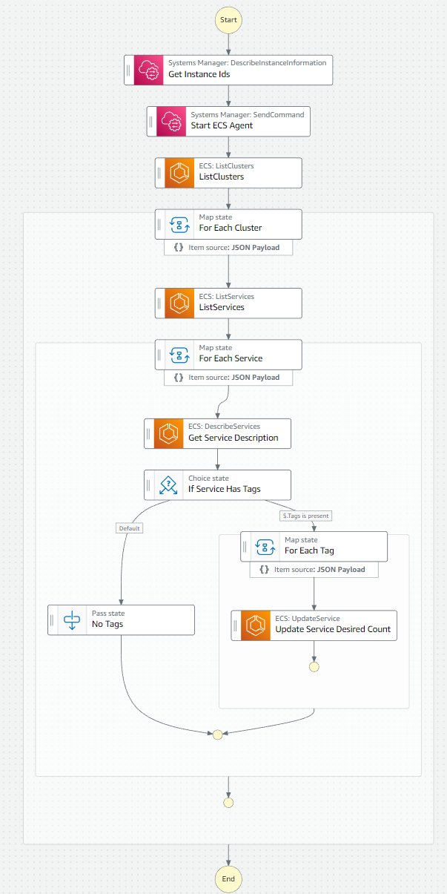
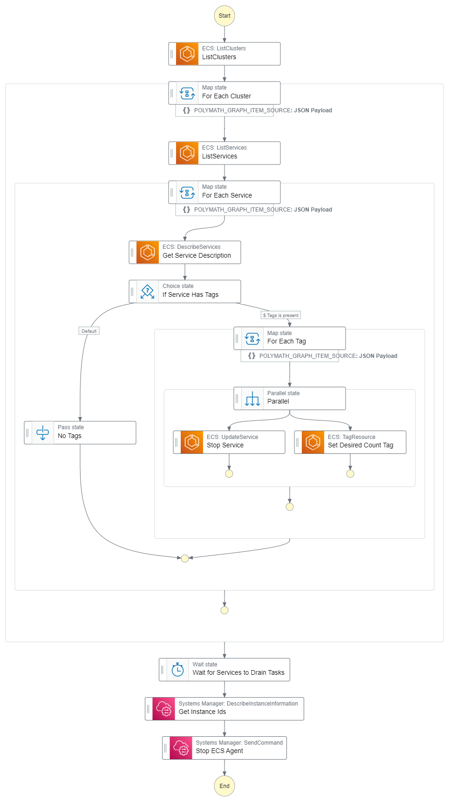

# Start and Stop ECS Anywhere Services
Two Step Functions to orchestrate the starting and stopping of ECS services and ECS Anywhere agents.

Use this to save money by turning off workloads and ECS Agents when they are not needed.

Becasue all ECS agents require SSM agent they can be started/stopped by calling an SSM run command.

Example 1: A national chain of Retail stores running on prem / in store workloads like computer vision, iot, and payments. Workloads / local services can be shut down over night, on holidays, etc. 

Example 2: A distributed, multi-cluster, real time stock trading applicatoin only runs durring US market hours, 9:30am to 4pm Eastern. Scheduled rules can be used to start and stop the entire distrbuted system only when it needs to be running.

Start Step Function

Stop Step Function

